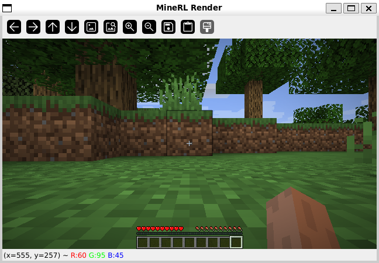

# CTRL-ALT-ACHIEVE: Minecraft Advancement Agent using MineRL
Brian Slonim, Tyler Hlaing, Brian Nguyen, Brett Hillyard, Seth Johnson

## Notes
* This is a project for CSC 480 at California Polytechnic State University, San Luis Obispo, under Dr. Rodrigo Canaan.
* This project relies heavily on the MineRL Python package, which can be found at this link: https://minerl.readthedocs.io/en/latest/index.html

## Installation
This repository is meant to be run on WSL2 and has not been tested on other operating systems.

Due to dependencies, we recommend using a Python virtual environment with Python version **3.11.9**. Later versions will NOT build!

1. Follow instructions from the MineRL documentation (https://minerl.readthedocs.io/en/latest/tutorials/index.html) to correctly install MineRL.
  * Ensure JDK 8 is installed on the system.
  * Ensure bash is installed on the system.
  * Install MineRL package via: `pip install git+https://github.com/minerllabs/minerl`
    * This takes a very long time, and may look like it is hanging. Be patient!

2. Then install stable-baselines3: `pip install stable-baselines3`

3. MineRL uses the old OpenAI gym package, while stable-baselines3 expects the newer gymnasium package. For compatibility, install shimmy: `pip install 'shimmy>=2.0'`

## Usage
The project is run using the agent.py file. Usage is as follows:

`python agent.py <T | I> <time steps> <model name>`

where `T` = train, `I` = inference, `<time steps>` is a positive integer, and `<model name>` excludes file extension if training a new model (in this case, the file extension will default to ".zip").

To begin, train a new model ("T") with the desired amount of time steps and the file name to save it as 
(excluding the file extension). Note that the Malmo environment tends to crash after a large amount 
of time steps, so we recommend limiting each training to 100,000 steps at maximum before creating a 
new environment.

To continue to train an existing agent, again use "T" with the desired number of time steps and the 
name of the file (including the file extension).

To run inference using an existing agent, use "I" with the desired number of time steps and the name 
of the file (including the file extension). Inference is automatically configured to render the environment 
for humans, so a GUI window will open showing the POV of the agent in the minecraft world. The visualization 
is essentially treated as a video stream from the agent's POV, and you cannot act on it other than to zoom 
the video in or out.

* Note: after starting the script, you may see this warning:

  \<frozen runpy>:128: RuntimeWarning: 'minerl.utils.process_watcher' found in sys.modules after import of package 'minerl.utils', but prior to execution of 'minerl.utils.process_watcher'; this may result in unpredictable behaviour"

  It does not appear to affect functionality, so it can be ignored.